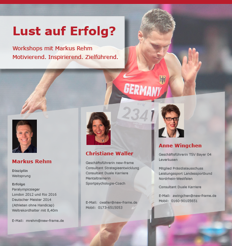

# Aktuelles - new-frame⎪Training, Coaching & Consulting

**URL**: https://new-frame.de/deutsch/aktuelles/2017.html?view=archive&month=5
**Meta Description**: new-frame bietet Dienstleistungen für Einzelpersonen und Unternehmen in den Bereichen Training, Coaching und Consulting an. Erfahren Sie mehr!
**Keywords**: new-frame, Training, Coaching, Consulting, Spitzenleistungen mit Spitzensportlern, Duale Karriere, wingwave, Vereinsentwicklung

## Component Hierarchy & Content

### Component 1: Website Logo (logo)

# 

---

### Component 2: Navigation Menu (menu)

- [Startseite](./home.md)
- [Consulting](./consulting.md)
- [Coaching/Training](./coaching.md)
- [Aktuelles](./aktuelles.md)
- [Über mich](./team.md)
- [Netzwerk](./netzwerk.md)
- [Kontakt](./kontakt.md)

---

### Component 3: Main Article Content (article_content)

MonatJanFebMärAprMaiJunJulAugSepOktNovDezJahr2015201720195101520253050100AlleFilter

## [Lust auf Erfolg? Workshops mit Markus Rehm](./aktuelles_63-lust-auf-erfolg-workshops-mit-markus-rehm.md)

DetailsVeröffentlicht: 08. Mai 2017

**** [Markus Rehm](./component_content_id_59.md)

Seine Geschichte und was Markus Rehm daraus gemacht hat, ist der Kern unseres Workshops. Wir geben Ihnen nicht nur die Möglichkeit, direkt mehr von ihm dazu zu erfahren, sondern auch seine Strategien für eine durchgängige Motivation zusammen mit versierten Trainern kennenzulernen und in Anwendung zu bringen.

**Der Workshop findet am 24.06.2017 von 10.00 - 17.00 Uhr auf Schloß Eulenbroich statt.**

[www.schloss-eulenbroich.de](http://www.schloss-eulenbroich.de)

Ihre Investition für diesen Tag voller Ereignisse ist € 350.- inkl. MwSt. Für Getränke und Snacks wird gesorgt.

**Anmeldungen sind leider nicht mehr möglich,Anmeldeschluss war der 19. Juni 2017 um 11 Uhr.**

Details

---

### Component 4: Social Media Links (social_links)

### Ältere Beiträge

- [September, 2019](./aktuelles_2019.md)
- [Mai, 2017](./aktuelles_2017.md)
- [April, 2017](./aktuelles_2017.md)
- [September, 2015](./aktuelles_2015.md)
- [August, 2015](./aktuelles_2015.md)

### Vernetzen

## LinkedIn

## XING

## YouTube

---

### Component 5: Footer & Legal Links (footer_copyright)

[new-frame](http://www.new-frame.de)

- [Impressum](./impressum.md)
- [Datenschutz](./datenschutz.md)
- [AGBs](./agbs.md)

---

## Page Assets (Local References)
- [close.png](../assets/images/modules/mod_cookiesaccept/img/close.png) (Original: http://new-frame.de/modules/mod_cookiesaccept/img/close.png)
- [new-frame_workshops_mit_markus_rehm.png](../assets/images/2017/new-frame_workshops_mit_markus_rehm.png) (Original: https://new-frame.de/images/2017/new-frame_workshops_mit_markus_rehm.png)
- [logo.png](../assets/images/logo/logo.png) (Original: https://new-frame.de/templates/favourite/images/logo/logo.png)
