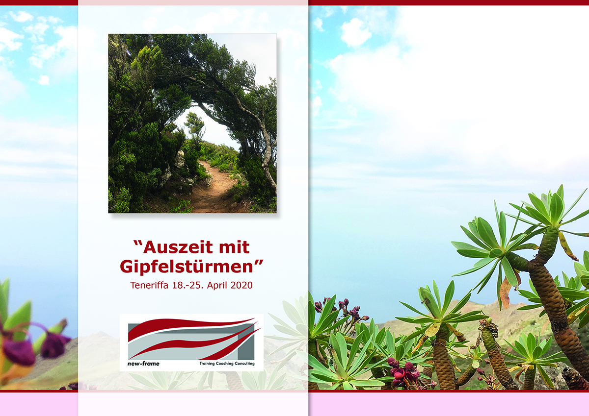
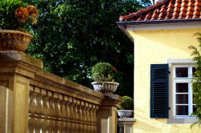
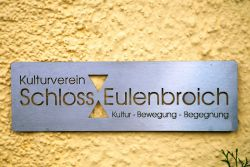
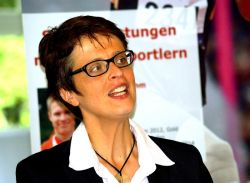
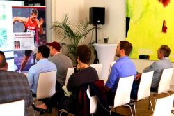
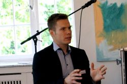
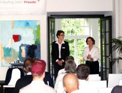
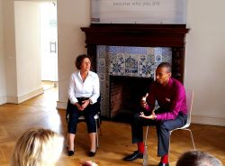

# Aktuelles - new-frame⎪Training, Coaching & Consulting

**URL**: https://new-frame.de/deutsch/aktuelles/2019.html?view=archive&month=9
**Meta Description**: new-frame bietet Dienstleistungen für Einzelpersonen und Unternehmen in den Bereichen Training, Coaching und Consulting an. Erfahren Sie mehr!
**Keywords**: new-frame, Training, Coaching, Consulting, Spitzenleistungen mit Spitzensportlern, Duale Karriere, wingwave, Vereinsentwicklung

## Component Hierarchy & Content

### Component 1: Website Logo (logo)

# 

---

### Component 2: Navigation Menu (menu)

- [Startseite](./home.md)
- [Consulting](./consulting.md)
- [Coaching/Training](./coaching.md)
- [Aktuelles](./aktuelles.md)
- [Über mich](./team.md)
- [Netzwerk](./netzwerk.md)
- [Kontakt](./kontakt.md)

---

### Component 3: Main Article Content (article_content)

MonatJanFebMärAprMaiJunJulAugSepOktNovDezJahr2015201720195101520253050100AlleFilter

## [Seminarreise "Auszeit mit Gipfelstürmen" Teneriffa 2020](./aktuelles_66-seminarreise-auszeit-mit-gipfelstuermen-teneriffa-2020.md)

DetailsVeröffentlicht: 18. September 2019

**Bewegen - Entspannen – Reflektieren**

In dieser Woche haben Sie die Möglichkeit, sich intensiv um sich selbst, Ihre Fitness und Ihr Wohlbefinden zu kümmern. In diversen Trainingssessions können Sie reflektieren, was gerade wichtig für Sie ist und erlernen wirksame Instrumente zum Selbst- und Emotionsmanagement.

**Zeitraum:**

Details

## [KickOff-Veranstaltung "Spitzenleistungen mit Spitzensportlern"](./aktuelles_47-kickoff-veranstaltung-spitzenleistungen-mit-spitzensportlern.md)

DetailsVeröffentlicht: 28. September 2015

**[hier zum Download](../assets/documents/images/downloads/startschuss_neues_trainingskonzept_new-frame.pdf)**

Vielen Dank nochmals an alle Beteiligten und Gäste für die mehr als gelungene Veranstaltung.

#### Impressionen von der Veranstaltung im Schloss Eulenbroich:

- 
- 
- 
- 

- 
- 
- 
- 
Details

---

### Component 4: Social Media Links (social_links)

### Ältere Beiträge

- [September, 2019](./aktuelles_2019.md)
- [Mai, 2017](./aktuelles_2017.md)
- [April, 2017](./aktuelles_2017.md)
- [September, 2015](./aktuelles_2015.md)
- [August, 2015](./aktuelles_2015.md)

### Vernetzen

## LinkedIn

## XING

## YouTube

---

### Component 5: Footer & Legal Links (footer_copyright)

[new-frame](http://www.new-frame.de)

- [Impressum](./impressum.md)
- [Datenschutz](./datenschutz.md)
- [AGBs](./agbs.md)

---

## Page Assets (Local References)
- [close.png](../assets/images/modules/mod_cookiesaccept/img/close.png) (Original: http://new-frame.de/modules/mod_cookiesaccept/img/close.png)
- [startschuss_neues_trainingskonzept_new-frame.pdf](../assets/documents/images/downloads/startschuss_neues_trainingskonzept_new-frame.pdf) (Original: https://new-frame.de/images/downloads/startschuss_neues_trainingskonzept_new-frame.pdf)
- [workshop_teil1_001.jpg](../assets/images/news/kickoff_2015/thumbs/workshop_teil1_001.jpg) (Original: https://new-frame.de/images/news/kickoff_2015/thumbs/workshop_teil1_001.jpg)
- [workshop_teil1_002.jpg](../assets/images/news/kickoff_2015/thumbs/workshop_teil1_002.jpg) (Original: https://new-frame.de/images/news/kickoff_2015/thumbs/workshop_teil1_002.jpg)
- [workshop_teil1_025.jpg](../assets/images/news/kickoff_2015/thumbs/workshop_teil1_025.jpg) (Original: https://new-frame.de/images/news/kickoff_2015/thumbs/workshop_teil1_025.jpg)
- [workshop_teil1_059.jpg](../assets/images/news/kickoff_2015/thumbs/workshop_teil1_059.jpg) (Original: https://new-frame.de/images/news/kickoff_2015/thumbs/workshop_teil1_059.jpg)
- [workshop_teil1_061.jpg](../assets/images/news/kickoff_2015/thumbs/workshop_teil1_061.jpg) (Original: https://new-frame.de/images/news/kickoff_2015/thumbs/workshop_teil1_061.jpg)
- [workshop_teil1_097.jpg](../assets/images/news/kickoff_2015/thumbs/workshop_teil1_097.jpg) (Original: https://new-frame.de/images/news/kickoff_2015/thumbs/workshop_teil1_097.jpg)
- [workshop_teil2_001.jpg](../assets/images/news/kickoff_2015/thumbs/workshop_teil2_001.jpg) (Original: https://new-frame.de/images/news/kickoff_2015/thumbs/workshop_teil2_001.jpg)
- [workshop_teil2_022.jpg](../assets/images/news/kickoff_2015/thumbs/workshop_teil2_022.jpg) (Original: https://new-frame.de/images/news/kickoff_2015/thumbs/workshop_teil2_022.jpg)
- [S_Flyer_Auszeit_2020_online.jpg](../assets/images/news/teneriffa_2020/S_Flyer_Auszeit_2020_online.jpg) (Original: https://new-frame.de/images/news/teneriffa_2020/S_Flyer_Auszeit_2020_online.jpg)
- [logo.png](../assets/images/logo/logo.png) (Original: https://new-frame.de/templates/favourite/images/logo/logo.png)
