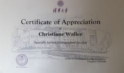
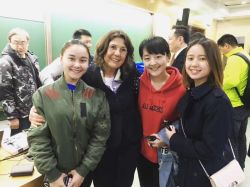
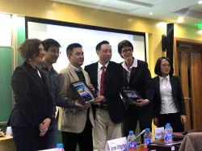
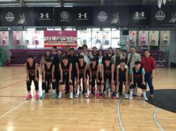
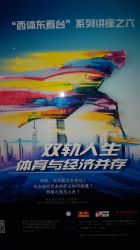

# Vortrag „Sport und Karriere – Inspiration auf dem Weg zum Erfolg“ - new-frame⎪Training, Coaching & Consulting

**URL**: https://new-frame.de/deutsch/aktuelles/55-vortrag-sport-und-karriere-inspiration-auf-dem-weg-zum-erfolg.html
**Meta Description**: new-frame bietet Dienstleistungen für Einzelpersonen und Unternehmen in den Bereichen Training, Coaching und Consulting an. Erfahren Sie mehr!
**Keywords**: new-frame, Training, Coaching, Consulting, Spitzenleistungen mit Spitzensportlern, Duale Karriere, wingwave, Vereinsentwicklung

## Component Hierarchy & Content

### Component 1: Website Logo (logo)

# 

---

### Component 2: Navigation Menu (menu)

- [Startseite](./home.md)
- [Consulting](./consulting.md)
- [Coaching/Training](./coaching.md)
- [Aktuelles](./aktuelles.md)
- [Über mich](./team.md)
- [Netzwerk](./netzwerk.md)
- [Kontakt](./kontakt.md)

---

### Component 3: Main Article Content (article_content)

## Vortrag „Sport und Karriere – Inspiration auf dem Weg zum Erfolg“

DetailsVeröffentlicht: 18. April 2017

Christiane Waller (new-frame) wurde von der Tsinghua Universität Beijing und Mason Invest, einer international arbeitende Consultinggruppe, als Rednerin zu einem Vortrag eingeladen. Thema des Abends war: „Sport und Karriere – Inspiration auf dem Weg zum Erfolg“

[Duale Karriere](./angebot_duale-karriere.md)

Der offene Austausch wurde von beiden Seiten als informativ und zielführend empfunden.

#### Impressionen zum Vortrag:

- 
- 
- 
- 

- 
- 

---

### Component 4: Social Media Links (social_links)

### Ältere Beiträge

- [September, 2019](./aktuelles_2019.md)
- [Mai, 2017](./aktuelles_2017.md)
- [April, 2017](./aktuelles_2017.md)
- [September, 2015](./aktuelles_2015.md)
- [August, 2015](./aktuelles_2015.md)

### Vernetzen

## LinkedIn

## XING

## YouTube

---

### Component 5: Footer & Legal Links (footer_copyright)

[new-frame](http://www.new-frame.de)

- [Impressum](./impressum.md)
- [Datenschutz](./datenschutz.md)
- [AGBs](./agbs.md)

---

## Page Assets (Local References)
- [close.png](../assets/images/modules/mod_cookiesaccept/img/close.png) (Original: http://new-frame.de/modules/mod_cookiesaccept/img/close.png)
- [1_new_frame_tsinghua_universitaet_beijing2.jpg](../assets/images/news/vortrag_peking_uni/thumbs/1_new_frame_tsinghua_universitaet_beijing2.jpg) (Original: https://new-frame.de/images/news/vortrag_peking_uni/thumbs/1_new_frame_tsinghua_universitaet_beijing2.jpg)
- [2_new_frame_vortrag_universitaet1.jpg](../assets/images/news/vortrag_peking_uni/thumbs/2_new_frame_vortrag_universitaet1.jpg) (Original: https://new-frame.de/images/news/vortrag_peking_uni/thumbs/2_new_frame_vortrag_universitaet1.jpg)
- [3_new_frame_vortrag_universitaet2.jpg](../assets/images/news/vortrag_peking_uni/thumbs/3_new_frame_vortrag_universitaet2.jpg) (Original: https://new-frame.de/images/news/vortrag_peking_uni/thumbs/3_new_frame_vortrag_universitaet2.jpg)
- [4_new_frame_vortrag_universitaet3.jpg](../assets/images/news/vortrag_peking_uni/thumbs/4_new_frame_vortrag_universitaet3.jpg) (Original: https://new-frame.de/images/news/vortrag_peking_uni/thumbs/4_new_frame_vortrag_universitaet3.jpg)
- [5_new_frame_vortrag_universitaet4.jpg](../assets/images/news/vortrag_peking_uni/thumbs/5_new_frame_vortrag_universitaet4.jpg) (Original: https://new-frame.de/images/news/vortrag_peking_uni/thumbs/5_new_frame_vortrag_universitaet4.jpg)
- [6_new_frame_tsinghua_universitaet_beijing.jpg](../assets/images/news/vortrag_peking_uni/thumbs/6_new_frame_tsinghua_universitaet_beijing.jpg) (Original: https://new-frame.de/images/news/vortrag_peking_uni/thumbs/6_new_frame_tsinghua_universitaet_beijing.jpg)
- [logo.png](../assets/images/logo/logo.png) (Original: https://new-frame.de/templates/favourite/images/logo/logo.png)
