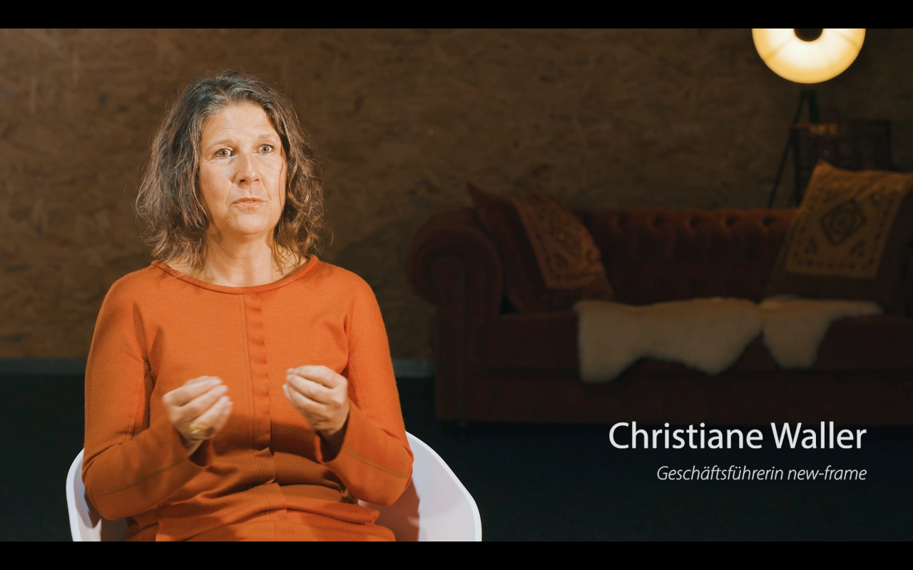

# Coaching/Training - new-frame⎪Training, Coaching & Consulting

**URL**: https://new-frame.de/deutsch/coaching.html
**Meta Description**: new-frame bietet Dienstleistungen für Einzelpersonen und Unternehmen in den Bereichen Training, Coaching und Consulting an. Erfahren Sie mehr!
**Keywords**: new-frame, Training, Coaching, Consulting, Spitzenleistungen mit Spitzensportlern, Duale Karriere, wingwave, Vereinsentwicklung

## Component Hierarchy & Content

### Component 1: Website Logo (logo)

# 

---

### Component 2: Navigation Menu (menu)

- [Startseite](./home.md)
- [Consulting](./consulting.md)
- [Coaching/Training](./coaching.md)
- [Aktuelles](./aktuelles.md)
- [Über mich](./team.md)
- [Netzwerk](./netzwerk.md)
- [Kontakt](./kontakt.md)

---

### Component 3: Main Article Content (article_content)

## Coaching

Die Basis sind zum Beispiel bilaterale Hemisphärenstimulation, NLP-Fragetechniken und Kinesiologie. Spezialisten und erfahrene Coaches passen das Coaching individuell auf Ihre Bedürfnisse an.

### Einzelcoaching

Einzelcoachings bieten die Möglichkeit Einzelpersonen ganz spezifisch weiterzuentwickeln. In einem vertraulichen Rahmen können berufliche und persönliche Ziele mit dem Coach verwirklicht werden.

### Gruppencoaching

In Gruppencoachings oder Supervisionsrunden können Sie für einzelne Gruppen Ihres Unternehmens individuelle Problemlösungen herbeiführen und die entsprechenden Mitarbeiter gemeinsam nach vorne bringen. Das kann bei Konflikten in einzelnen Abteilungen oder in der Managementebene sinnvoll sein.

### **w** **w**

**[Was ist wingwave®-Coaching? (externer Link)](http://wingwave.com/)**

[**wingwave®-Coaching in der Sportpraxis**](../assets/documents/images/downloads/sport-coaching_wingwave.pdf)

## Training

Das wichtigste Kapital eines Unternehmens sind die Mitarbeiter*innen. Diese müssen durch die kontinuierliche Weiterentwicklung eines Unternehmens geführt und mitgenommen werden. Meist ist es deutlich leichter, Prozesse und Strukturen zu verändern, als die emotionale Beteiligung der Belegschaft dafür zu gewinnen. Es gilt die Mitarbeiter*innen fachlich und emotional fit für die anstehenden Themen zu machen. Ganz konkret können hier zum Beispiel gezielte Führungskräftetrainings in kleinen Gruppen schnell zu großen Erfolgen führen.

## Energetische Psychologie

Die energetische Psychologie basiert auf der Grundannahme, dass unsere Meridiane bzw. Energiefelder im Körper gelegentlich Blockaden aufweisen. Sie werden über eine Kombination aus einer Klopftechnik, kinesiologischen Tests und begleitenden Sprachmustern wieder in Fluss gebracht.

Energetische Psychologie ist besonders erfolgreich bei:
spezifischen Ängsten, negativen Erfahrungen, Kummer, Niedergeschlagenheit,
 Selbstwertproblemen, Schuld- und Schamgefühlen,
 Leistungsblockaden, Energielosigkeit,
 Frustrationen, Unruhe, Nervosität und Ärger, Schmerzzuständen, Jetlag 
sowie bei Essstörungen und anderen Suchtverhalten

[**Mehr Informationen zu energetischer Psychologie (externer Link)**](http://energypsych.com/)

---

### Component 4: Social Media Links (social_links)

### Vernetzen

## LinkedIn

## XING

## YouTube

---

### Component 5: Footer & Legal Links (footer_copyright)

[new-frame](http://www.new-frame.de)

- [Impressum](./impressum.md)
- [Datenschutz](./datenschutz.md)
- [AGBs](./agbs.md)

---

## Page Assets (Local References)
- [close.png](../assets/images/modules/mod_cookiesaccept/img/close.png) (Original: http://new-frame.de/modules/mod_cookiesaccept/img/close.png)
- [sport-coaching_wingwave.pdf](../assets/documents/images/downloads/sport-coaching_wingwave.pdf) (Original: https://new-frame.de/images/downloads/sport-coaching_wingwave.pdf)
- [new-frame_imagefilm_christiane_waller_s.jpg](../assets/images/videos/new-frame_imagefilm_christiane_waller_s.jpg) (Original: https://new-frame.de/images/videos/new-frame_imagefilm_christiane_waller_s.jpg)
- [new-frame_imagefilm_christiane_waller_s.mp4](../assets/videos/new-frame_imagefilm_christiane_waller_s.mp4) (Original: https://new-frame.de/images/videos/new-frame_imagefilm_christiane_waller_s.mp4)
- [weiterbildungsexperten_200px.png](../assets/images/weiterbildungsexperten_200px.png) (Original: https://new-frame.de/images/weiterbildungsexperten_200px.png)
- [logo.png](../assets/images/logo/logo.png) (Original: https://new-frame.de/templates/favourite/images/logo/logo.png)
