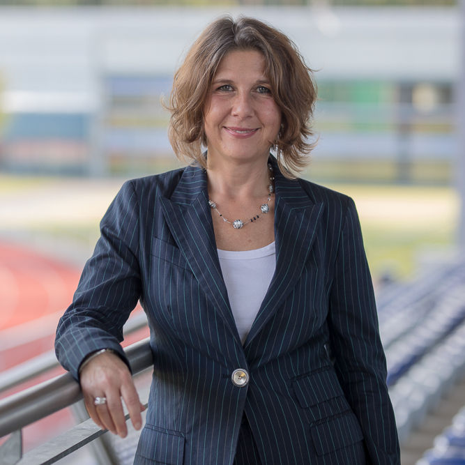

# Startseite - new-frame⎪Training, Coaching & Consulting

**URL**: https://new-frame.de/deutsch/
**Meta Description**: new-frame bietet Dienstleistungen für Einzelpersonen und Unternehmen in den Bereichen Training, Coaching und Consulting an. Erfahren Sie mehr!
**Keywords**: new-frame, Training, Coaching, Consulting, Spitzenleistungen mit Spitzensportlern, Duale Karriere, wingwave, Vereinsentwicklung

## Component Hierarchy & Content

### Component 1: Website Logo (logo)

# 

---

### Component 2: Navigation Menu (menu)

- [Startseite](./home.md)
- [Consulting](./consulting.md)
- [Coaching/Training](./coaching.md)
- [Aktuelles](./aktuelles.md)
- [Über mich](./team.md)
- [Netzwerk](./netzwerk.md)
- [Kontakt](./kontakt.md)

---

### Component 3: Section 1 (page_builder_section)
*Element ID*: `section-id-1702484441219`

---

### Component 4: Consulting für Ihren Erfolg (page_builder_section)
*Element ID*: `section-id-1702484441225`

### Consulting für Ihren Erfolg

Wir verbinden Menschen und Organisationen: Mit einem high-end internationalen Netzwerk unterstützt new-frame Firmen und Organisationen dabei Geschäfte, zum Beispiel im internationalen Verkauf, noch erfolgreicher zu gestalten. Die gesamten Prozesse werden professionell begleitet und bis zum Abschluss gebracht. Ihre geschäftliche und persönliche Entwicklung ist bei uns in den richtigen Händen.

 [Mehr zum Consulting](./consulting.md) 

### Coaching & Training

Mit verschiedenen Trainings- und Coachingkompetenzen begleiten wir Sie und Ihre Organisationen im Soft-Skills Bereich durch Veränderungs- und Entwicklungsprozesse.         Unser Haupt-Fokus liegt dabei auf Talenten im Management und im Hochleistungssport.

 [Mehr zum Coaching & Training](./coaching.md) 

---

### Component 5: KONTAKT (page_builder_section)
*Element ID*: `section-id-1702495994352`

### KONTAKT

**Christiane Waller - Geschäftsführerin new-frame**

*Historisches Gebäude „Alter Bahnhof Gangelt“:*

*Barrierefreies Arbeiten auf dem Bauernhof:*

[info@new-frame.de](mailto:info@new-frame.de)

---

### Component 6: References / Testimonials Slider (references_slider)

"Ich kann PRI jeder Führungskraft empfehlen, die sich in ihrem Berufsalltag mit unterschiedlichen und komplexen Themen auseinandersetzen muss.
Es ist ein sehr detaillierter Weg, um herauszufinden, wo Ihre Vorteile liegen und in welchem Bereich Sie die Chance haben, sich weiterzuentwickeln um effizienter zu werden und gleichzeitig sowohl im Beruf, als auch in zwischenmenschlichen Beziehungen stets überlegt und souverän zu agieren."

# Christian Kühnel - Lausitzer Stahlbau Ruhland GmbH:

---

"Der PRI hat mir geholfen, die Stressfaktoren besser zu identifizieren und gezielt Maßnahmen für eine positive Veränderung zu ergreifen. Wir setzen den PRI auch für unser Team ein. Alle Mitarbeiter sollen ebenfalls von diesen Vorteilen profitieren. Das hat die Bewältigung von Herausforderungen und Stress extrem leichter gemacht als früher."

# Michael Radmer - WELL SERVICES GmbH:

---

"New Frame hat mir damals geholfen, meine Augen zu öffnen. Ich wusste nicht genau, wo ich im Leben stehe bzw. wo mein Weg irgendwann hinführen sollte. Durch verschiedene Coachings konnte ich herausfinden, wo mein derzeitiger Standpunkt gerade ist und was ich brauche um die wichtigen Entscheidungen für meine Zukunft zu treffen. 
Auch sportlich war das Coaching ein voller Erfolg. Als zweite Torhüterin ist es oft nicht leicht, ruhig und sachlich auf die Situation zu schauen. Durch das Coaching habe ich viele Techniken erlernt, die ich auf gewisse Situationen im Sport anwenden kann, um auch mal einen anderen Blickwinkel auf manche Dinge zu bekommen. Eine neutrale Sicht auf viele Situationen hilft manchmal...

# Anna Klink - Torhüterin Bayer 04 Leverkusen - Duale Karriere:

---

"...Ihr Auftrag war es, uns als junges und neu zusammengestelltes Team in unseren bestehenden Abläufen zu analysieren, weiter zu entwickeln und gewinnbringend zu unterstützen. Dies haben Sie in mehreren Ein- und Mehrtagesseminaren hervorragend umgesetzt.
Die Vorbereitung auf die einzelnen Schulungen war immer sehr professionell. Sowohl die Auswahl der Übungen mit einem Wechsel zwischen theoretischem Input und Gruppenarbeiten in der Praxis, als auch die Vermittlung der Inhalte waren stets leicht nachvollziehbar und sehr gut erklärt. Dies machte die vorgeschlagene Implementierung der Ergebnisse in unsere Prozesse sehr einfach..."

# Herbert Ott - Betriebliches Gesundheitsmanagement TSV Bayer 04 Leverkusen e.V.:

 [Link zum vollständigen Referenzschreiben](../assets/documents/Referenz_TSV_Betriebliches_Gesundheitsmanagement.pdf)

---

### Component 7: Social Media Links (social_links)

### Vernetzen

## LinkedIn

## XING

## YouTube

---

### Component 8: Footer & Legal Links (footer_copyright)

[new-frame](http://www.new-frame.de)

- [Impressum](./impressum.md)
- [Datenschutz](./datenschutz.md)
- [AGBs](./agbs.md)

---

## Page Assets (Local References)
- [close.png](../assets/images/modules/mod_cookiesaccept/img/close.png) (Original: http://new-frame.de/modules/mod_cookiesaccept/img/close.png)
- [coaching-training-new-frame.jpg](../assets/images/2023/12/18/coaching-training-new-frame.jpg) (Original: https://new-frame.de/images/2023/12/18/coaching-training-new-frame.jpg)
- [consulting-new-frame.jpg](../assets/images/consulting/consulting-new-frame.jpg) (Original: https://new-frame.de/images/consulting/consulting-new-frame.jpg)
- [Referenz_TSV_Betriebliches_Gesundheitsmanagement.pdf](../assets/documents/Referenz_TSV_Betriebliches_Gesundheitsmanagement.pdf) (Original: https://new-frame.de/images/pdf/Referenz_TSV_Betriebliches_Gesundheitsmanagement.pdf)
- [startseite.jpg](../assets/images/slideshows/startseite.jpg) (Original: https://new-frame.de/images/slideshows/startseite.jpg)
- [christiane_waller.jpg](../assets/images/team/christiane_waller.jpg) (Original: https://new-frame.de/images/team/christiane_waller.jpg)
- [logo.png](../assets/images/logo/logo.png) (Original: https://new-frame.de/templates/favourite/images/logo/logo.png)
