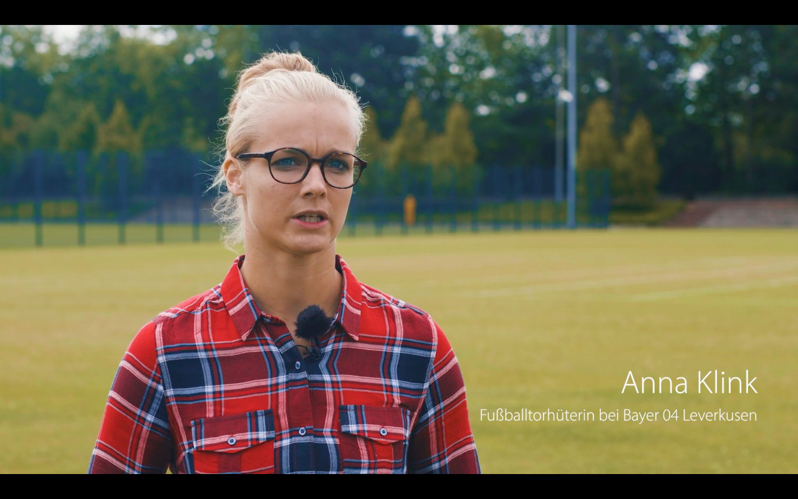
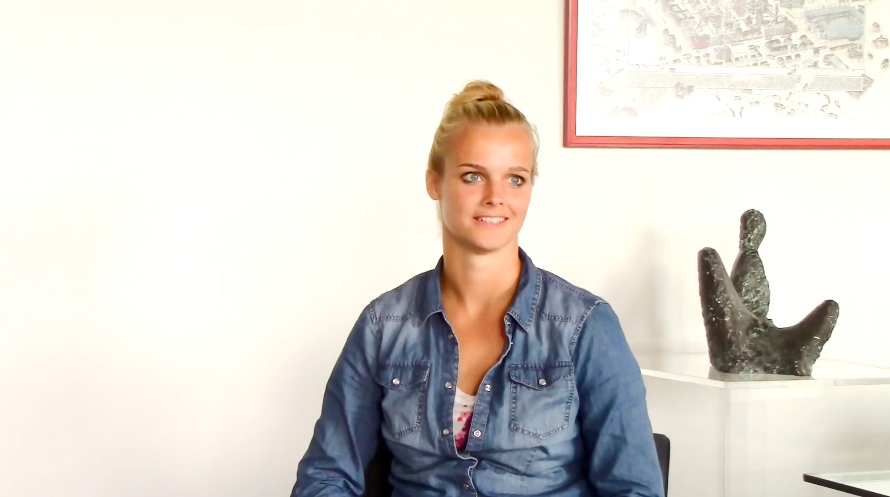

# Über mich - new-frame⎪Training, Coaching & Consulting

**URL**: https://new-frame.de/deutsch/team.html
**Meta Description**: new-frame bietet Dienstleistungen für Einzelpersonen und Unternehmen in den Bereichen Training, Coaching und Consulting an. Erfahren Sie mehr!
**Keywords**: new-frame, Training, Coaching, Consulting, Spitzenleistungen mit Spitzensportlern, Duale Karriere, wingwave, Vereinsentwicklung

## Component Hierarchy & Content

### Component 1: Website Logo (logo)

# 

---

### Component 2: Navigation Menu (menu)

- [Startseite](./home.md)
- [Consulting](./consulting.md)
- [Coaching/Training](./coaching.md)
- [Aktuelles](./aktuelles.md)
- [Über mich](./team.md)
- [Netzwerk](./netzwerk.md)
- [Kontakt](./kontakt.md)

---

### Component 3: Main Article Content (article_content)

## Über mich

## 

Ich wurde 1963 in Weil am Rhein geboren und bin dort aufgewachsen. Bedingt durch die Nähe zur Schweiz habe ich mich auf einer privaten Handelsschule (NSH - Handel und Kader) ausbilden lassen. Über Lufthansa führte mich mein Weg in die Selbständigkeit als Trainerin und Coach.

Begegnungen mit Menschen sind das zentrale Thema in meinem Leben. Es ist immer wieder absolut fantastisch zu sehen, zu welchen Leistungen Menschen fähig sind, wenn sie die richtigen Impulse bekommen.

Heinz von Försters Ausspruch "Der Mensch ist kein human being, sondern ein human becoming" gibt meine Grundhaltung gegenüber meinen Mitmenschen ziemlich genau wieder. Ich glaube fest an die Entwicklungsmöglichkeiten, die uns allen offenstehen.

Mein Bestreben ist es, nachhaltig und erfolgsorientiert für Sie zu arbeiten. Das bestmögliche Rüstzeug für dieses Ziel hole ich mir in kontinuierlichen Weiterbildungen und Supervisionen.

Ich habe folgende Zertifizierungen:

- NLP Lehrtrainerin (DVNLP)
- NLP Coach (DVNLP)
- wingwave-Coach
- TTT – Trauma Tapping Technique
- Coach für Energetische Psychologie nach Dr. Fred Gallo
- Ausbildung in Provokativem Stil nach Dr. Frank Farrelly
- Crew Ressource Management

## Videos: Die Coaching-Arbeit von new-frame im Überblick

Imagefilm über die Arbeit von new-frame, mit Stimmen von Christiane Waller (CEO new-frame) und verschiedenen Klienten

### Duale Karriere: Anna Klink über Ihre Erfahrungen

Anna Klink spricht als Testimonial über ihre Erfahrungen in der Arbeit mit new-frame

Anna Klink ist Torhüterin des Bayer 04 Leverkusen und U 20 Weltmeisterin. In Ihrer Laufbahn hat sie sich für den nachhaltigen Weg einer Dualen Karriere entschieden, dessen Vorteile sie in den Video-Blogs der nächsten Wochen näher erläutert. Sie wird hier auch näher auf die Wirkung des persönlichen Trainings und Coachings von new-frame eingehen, das sie in diesem Rahmen über den TSV Bayer 04 Leverkusen als weiteres Element für ihren Erfolg nutzen konnte. Natürlich erzählt sie auch über ihre Visionen für die Zukunft… Genießen Sie diese lebendigen und hoch motivierenden Statements!

---

### Component 4: Social Media Links (social_links)

### Vernetzen

## LinkedIn

## XING

## YouTube

---

### Component 5: Footer & Legal Links (footer_copyright)

[new-frame](http://www.new-frame.de)

- [Impressum](./impressum.md)
- [Datenschutz](./datenschutz.md)
- [AGBs](./agbs.md)

---

## Page Assets (Local References)
- [close.png](../assets/images/modules/mod_cookiesaccept/img/close.png) (Original: http://new-frame.de/modules/mod_cookiesaccept/img/close.png)
- [christiane_waller.jpg](../assets/images/team/christiane_waller.jpg) (Original: https://new-frame.de/images/team/christiane_waller.jpg)
- [new-frame_christiane_waller_testimonial_anna_klink_s.jpg](../assets/images/videos/new-frame_christiane_waller_testimonial_anna_klink_s.jpg) (Original: https://new-frame.de/images/videos/new-frame_christiane_waller_testimonial_anna_klink_s.jpg)
- [new-frame_christiane_waller_testimonial_anna_klink_s.mp4](../assets/videos/new-frame_christiane_waller_testimonial_anna_klink_s.mp4) (Original: https://new-frame.de/images/videos/new-frame_christiane_waller_testimonial_anna_klink_s.mp4)
- [new-frame_imagefilm_christiane_waller_s.jpg](../assets/images/videos/new-frame_imagefilm_christiane_waller_s.jpg) (Original: https://new-frame.de/images/videos/new-frame_imagefilm_christiane_waller_s.jpg)
- [new-frame_imagefilm_christiane_waller_s.mp4](../assets/videos/new-frame_imagefilm_christiane_waller_s.mp4) (Original: https://new-frame.de/images/videos/new-frame_imagefilm_christiane_waller_s.mp4)
- [newframeblog_Duale-Karriere_01.jpg](../assets/images/videos/newframeblog_Duale-Karriere_01.jpg) (Original: https://new-frame.de/images/videos/newframeblog_Duale-Karriere_01.jpg)
- [newframeblog_Duale-Karriere_01.mp4](../assets/videos/newframeblog_Duale-Karriere_01.mp4) (Original: https://new-frame.de/images/videos/newframeblog_Duale-Karriere_01.mp4)
- [logo.png](../assets/images/logo/logo.png) (Original: https://new-frame.de/templates/favourite/images/logo/logo.png)
